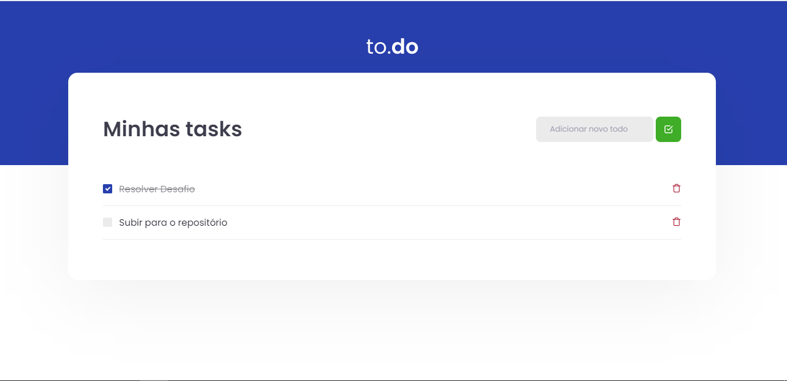

<h1 align="center">
  
</h1>

## Sobre
Resolução do 1º desafio do bootcamp Ignite by Rocketseat

## Tecnologias
- React
- Typescript

## Excutando o projeto
- Clone o repositório: 
- Instale todas as dependências com: ``` yarn ``` ou ``` npm install ```
- Inicio projeto: ``` yarn dev ``` ou ``` npm run dev ```

## Requisitos
- [x] Deve ser possivel adicionar uma tarefa
- [x] Não deve ser possivel adicionar uma tarefa com um título vazio
- [x] Deve ser possivel deletar uma tarefa
- [x] Deve ser possivel marcar como concluída uma tarefa

Para rodar os testes executar ``` yarn test ```

Acesse o projeto no endereço
http://localhost:8080